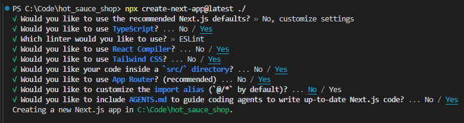

## This is an initial project structure that includes

- X Next application with defaults
- X Prisma setup with configuration
- Storybook
- X Initial component structure
- SDD spec folder structure and documentation
- agents.md
- X Tailwind
- testing
  - Vitest, React Testing, Playwright
- agents.md with architecture and standards notes
- CI/CD, Vercel?
- define grill me skill?, install it?
- define spec template?

- update README

- spec cycle, including project detail updates
  - beyond vibe coding
  - defining skills, establishing conventions, iteration, question prompting
  - takes time upfront, establishes standards
  - document feature flow
  - less syntax, must still understand every line of code
    - more architecture and best practice focus
  - cycle is to implement and document new patterns in agents.md
  - testing importantce
  - working small/incrementally

---

create skill structure:

my-project/
├── .agents/
│ └── skills/
│ ├── react-components/
│ │ └── SKILL.md
│ ├── testing/
│ │ └── SKILL.md
│ └── accessibility/
│ └── SKILL.md
├── src/
├── package.json
└── README.md

## Steps to create

### Initialize

[Create next app](https://nextjs.org/docs/app/api-reference/cli/create-next-app)

`npx create-next-app@latest ./`

With options:



https://www.prisma.io/docs/orm/v7/prisma-client/setup-and-configuration/introduction

https://storybook.js.org/docs/get-started/frameworks/nextjs-vite -

### TODO

.env note

prisma migrations

run migration/init

test from clean install with no existing DB

document everything

---

◇ Storybook was successfully installed in your project!
│
│ To run Storybook, run npm run storybook. CTRL+C to stop.
│
│ Official documentation reference: https://storybook.js.org/llms.txt
│
◇ To finalize setting up with AI, paste this prompt to your AI agent:

│ Run `npx storybook ai setup` and follow its instructions precisely.
'wmic' is not recognized as an internal or external command,
operable program or batch file.
│

---

_DEFAULT NEXT README..._

---

This is a [Next.js](https://nextjs.org) project bootstrapped with [`create-next-app`](https://nextjs.org/docs/app/api-reference/cli/create-next-app).

## Getting Started

First, run the development server:

```bash
npm run dev
# or
yarn dev
# or
pnpm dev
# or
bun dev
```

Open [http://localhost:3000](http://localhost:3000) with your browser to see the result.

You can start editing the page by modifying `app/page.tsx`. The page auto-updates as you edit the file.

This project uses [`next/font`](https://nextjs.org/docs/app/building-your-application/optimizing/fonts) to automatically optimize and load [Geist](https://vercel.com/font), a new font family for Vercel.

## Learn More

To learn more about Next.js, take a look at the following resources:

- [Next.js Documentation](https://nextjs.org/docs) - learn about Next.js features and API.
- [Learn Next.js](https://nextjs.org/learn) - an interactive Next.js tutorial.

You can check out [the Next.js GitHub repository](https://github.com/vercel/next.js) - your feedback and contributions are welcome!

## Deploy on Vercel

The easiest way to deploy your Next.js app is to use the [Vercel Platform](https://vercel.com/new?utm_medium=default-template&filter=next.js&utm_source=create-next-app&utm_campaign=create-next-app-readme) from the creators of Next.js.

Check out our [Next.js deployment documentation](https://nextjs.org/docs/app/building-your-application/deploying) for more details.
